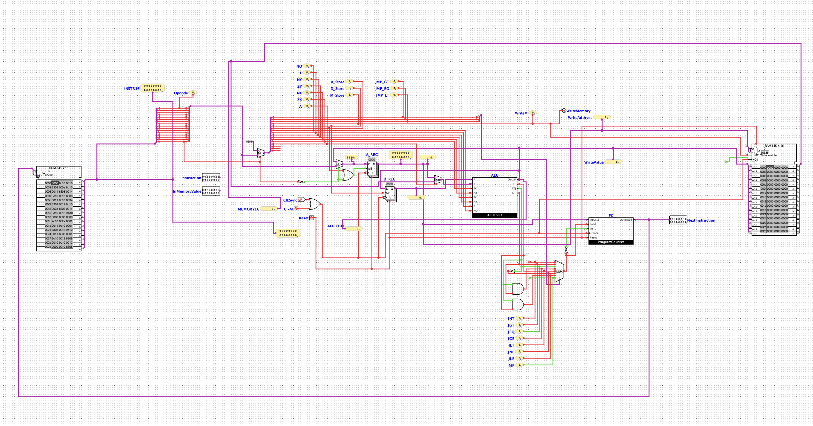

# Nand2Tetris Computer Project

## About
This is an implementation of a basic computer from scratch up to the assembly level, following the **Nand2Tetris** course.  
Includes:
- Logic gates and combinational circuits
- Sequential circuits
- CPU and memory
- Assembler and simple programs
- CPU interpreter implemented in **Rust**

## Interpreter
The assembler and CPU interpreter were implemented in **Rust**.

## **Screenshots**


## Code Examples
### 1. Defining variables and summing them
```asm
.data
        result = 0
        multiplicator_1 = 10
        multiplicator_2 = 20
.program
        ;setup
        @program_start
        JEQ multiplicator_1 @program_end
        JEQ multiplicator_2 @program_end

        ;switch
        SUB R0 multiplicator_1 multiplicator_2
        JGT R0 @loop_start
        MOV R1 multiplicator_1
        MOV multiplicator_1 multiplicator_2
        MOV multiplicator_2 R1 
        
        ;loop
        @loop_start
        ADD result result multiplicator_2
        SUB multiplicator_1 multiplicator_1 1
        JEQ multiplicator_1 @program_end
        JMP 0 @loop_start
        @program_end
        MOV RDX result
